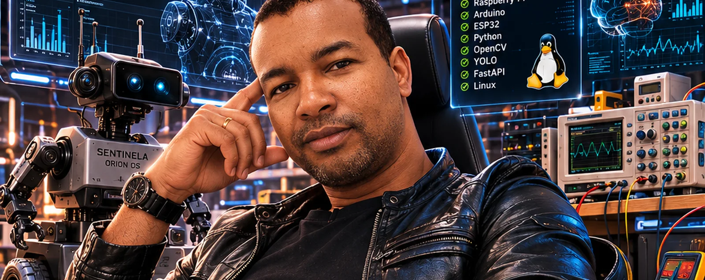

<p align="center">
  
</p>

<h1 align="center">ORION OS</h1>

<p align="center">
  <strong>Plataforma de robótica modular, 100% offline.</strong><br>
  Primeiro robô: <strong>Fofão</strong>.
</p>

<p align="center">
  <a href="https://jproma23.github.io/Orion-Os/"></a>
  
  
  
  
</p>

---

Um robô que percebe o ambiente, decide sozinho o que fazer e conversa com
quem mora na casa — **sem depender de nuvem para nada**. Visão, voz e
modelos de linguagem rodam localmente, no hardware que está na bancada.

**[→ Diário de bordo do desenvolvimento](https://jproma23.github.io/Orion-Os/)**
— cada sessão registrada no dia em que aconteceu, os acertos e os bugs que
custaram caro.

## Arquitetura

Três computadores em cadeia. Cada um só fala com o vizinho — o Notebook
nunca acessa o Arduino direto.

```
   Notebook 8 GB            Mission Core     IA, visão, voz, avatar
        │  Ethernet / TCP
   Raspberry Pi 4 + SSD     Motion Core      kernel, decisão, navegação, banco, web UI
        │  USB Serial
   Arduino Mega 2560        Hardware Core    motores, servos, sensores, segurança reativa
```

| Unidade | Hardware | Linguagem | Responsabilidade |
|---|---|---|---|
| **Mission Core** | Notebook 8 GB (Linux) | Python 3.11+ | Reconhecimento facial, conversa por voz, avatar, planejamento de missão |
| **Motion Core** | Raspberry Pi 4 (4 GB) + SSD 500 GB | Python 3.11+ | Kernel, Behavior Core, fusão de sensores, memória, interface web |
| **Hardware Core** | Arduino Mega 2560 | C++ (PlatformIO) | Tempo real: motores, servos, ultrassom, IMU, parada de emergência |

A divisão está fixada nos EDRs [0018](docs/edr/EDR-0018-arquitetura-tcc.md)
e [0019](docs/edr/EDR-0019-divisao-final-e-ssd.md); as regras invioláveis,
em [`ARQUITETURA.txt`](ARQUITETURA.txt).

## O que já funciona

- **Kernel próprio** — event bus assíncrono com fila de prioridades, service
  registry, health monitor, watchdog com escalonamento e boot manager
- **Behavior Core** — arbitragem de prioridade entre comportamentos
  autônomos: repouso, atender, vigília e desvio de obstáculo
- **Protocolo binário** entre Pi e Arduino — enquadramento por tamanho, CRC,
  ACK, heartbeat e reconexão automática
- **Visão** — reconhecimento facial: o robô sabe quem é da casa e dispara
  alerta para rosto desconhecido
- **Voz** — wake word, VAD e resposta falada, com modelo de linguagem local
- **Memória** — diário de observações em banco, com consulta determinística
  ("você viu o fulano hoje?") separada da conversa livre
- **Navegação** — fusão de odometria e IMU publicando `motion.position`
- **Interface web** — dashboard com mapa polar do radar, telemetria ao vivo,
  diagnóstico e configuração

## Estrutura

```
src/orion/          Mission Core: kernel, communication, vision, voice, mission, display
motion_core/        Motion Core: behavior, navigation, memory, webui
firmware/           Hardware Core: firmware do Arduino Mega (PlatformIO)
docs/ses/           Especificação do sistema, capítulos 01 a 20
docs/edr/           Registros de decisão de arquitetura
docs/journal.md     Diário de bordo — vira o blog via tools/build_blog.py
config/orion.yaml   Configuração única do sistema
tests/              305 testes
```

## Como rodar

```bash
python3 -m venv .venv && source .venv/bin/activate
pip install -e ".[dev]"

python -m orion --sim     # sobe o sistema em simulação, sem hardware
python -m orion           # boot real
```

Testes e lint:

```bash
tools/check.sh            # ruff + pytest
```

O firmware do Arduino fica em `firmware/hardware_core/`, compilado com
PlatformIO.

## Documentação

| | |
|---|---|
| [Diário de bordo](https://jproma23.github.io/Orion-Os/) | Como o projeto foi construído, dia a dia |
| [`ARQUITETURA.txt`](ARQUITETURA.txt) | Regras invioláveis — leia antes de implementar |
| [`docs/ses/`](docs/ses/) | Especificação completa, capítulos 01–20 |
| [`docs/edr/`](docs/edr/) | Decisões de arquitetura e o porquê de cada uma |
| [`PLANO_IMPLEMENTACAO.md`](PLANO_IMPLEMENTACAO.md) | Fases de desenvolvimento |

---

<p align="center">
  Desenvolvido por <strong>João Paulo</strong> ·
  <a href="https://github.com/jproma23">@jproma23</a>
</p>
